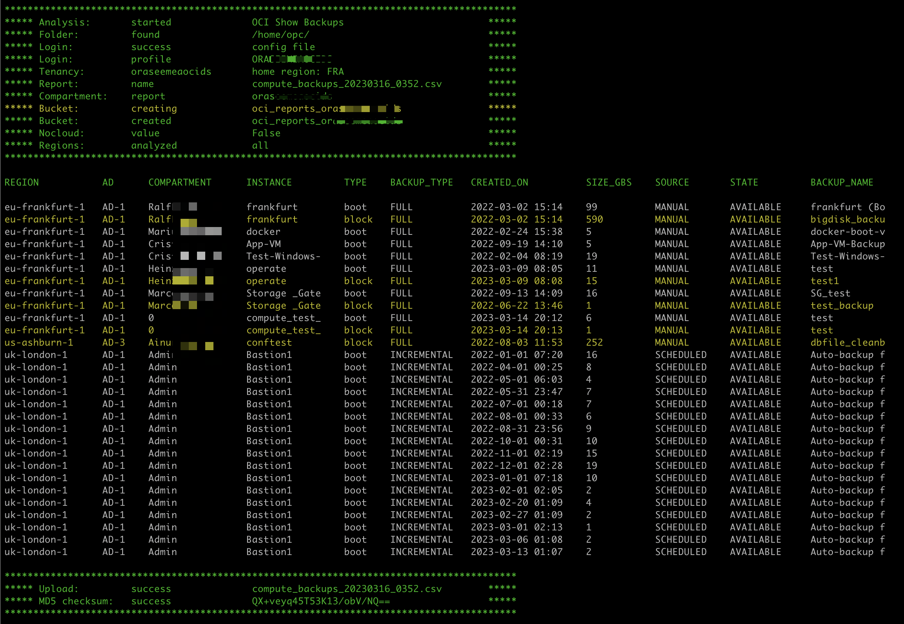
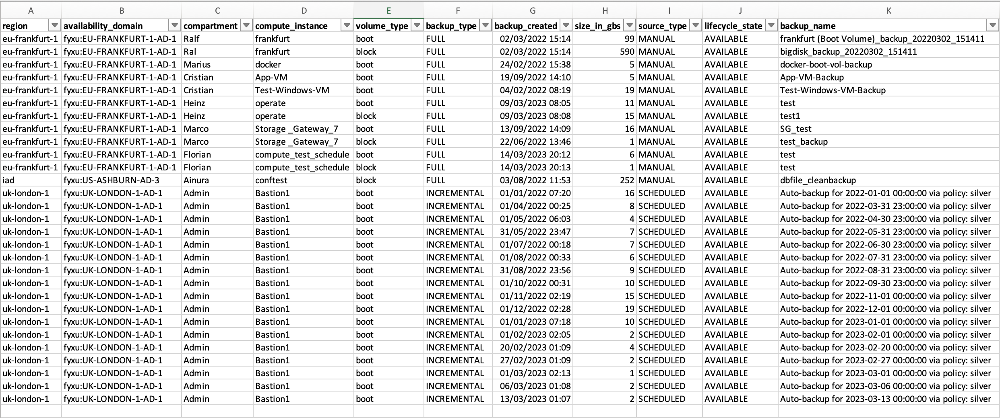

# OCI-ShowBackups

**ShowBackups** is a demonstration script showing you how to list compute instance backups (boot & volumes).

# Quick install on Oracle Linux 7.9 

	curl https://raw.githubusercontent.com/Olygo/OCI-ShowBackups/main/install.sh | bash

	- install dependencies
	- clone git repo locally
	- schedule cron everyday at 8AM

# Features 
- **ShowBackups** :
	- searches for compute instances
	- retrieves all attached volumes 
	- lists all volume backups found
	- generates csv report
	- stores csv report in an oci bucket 

- Support for using the script with Instance Principals. Meaning you can run this script inside OCI and when configured properly, you do not need to provide any details or credentials

-**Parameters for execution:**

```
-cs                      	authenticate through CloudShell Delegation Token
-cf                      	authenticate through local OCI config_file
-cfp      config_file     	change OCI config_file path, default: ~/.oci/config
-cp       config_profile  	indicate config file section to use, default: DEFAULT
-c        compartment_ocid  	compartment to store the bucket report, default: root
-b        bucket_name       	bucket name to store the report, default: reports_YOUR_TENANT_NAME
-rf       report_folder     	local folder path to store the report, default: ~
-rn       report_name       	name of the csv report, default: compute_backups_CURRENT_DATE_TIME
-nocloud                    	if used: do not store csv report on OCI, default: False
-tlc      compartment_ocid  	scan only a specific compartment, default: scan from root compartment
-rg       region_name  		scan only a specific region, default: scan all regions
-h,       --help            	show this help message and exit

```

# Install script into (free-tier) Autonomous Linux Instance

- Use an existing VCN or create a dedicated vcn (preferred) in a public or a private subnet (preferred if vpn or fastconnect)
- Create a free-tier compute instance using the Autonomous Linux 7.9 image
- Create a Dynamic Group called OCI_Scripting and add the OCID of your instance to the group, using this command:
  - `ANY {instance.id = 'OCID_of_your_Compute_Instance'}`
- Create a root level policy, giving your dynamic group permission to manage resources in tenancy:

	- you can use :

			allow dynamic-group OCI_Scripting to manage all-resources in tenancy

	- but the following statements are sufficients:

			allow dynamic-group OCI_Scripting to read all-resources in tenancy
 
			allow dynamic-group OCI_Scripting to manage object-family in tenancy where any {request.permission='BUCKET_CREATE', request.permission='OBJECT_CREATE', request.permission='OBJECT_OVERWRITE'}

- Login to your instance using an SSH connection

- Run the following commands:
  - sudo yum update -y
  - sudo yum install git -y
  - python3 -m pip install oci oci-cli --user
  - git clone https://github.com/Olygo/OCI-ShowBackups.git
  - cd ./OCI-ShowBackups
  - python3 OCI-ShowBackups.py


# How to use
##### Default - No argument:
	
	python3 ./OCI-ShowBackups.py

without arguments **OCI-ShowBackups** tries to authenticate using Instance Principals

##### Authenticate with local_config_file:
	
	python3 ./OCI-ShowBackups.py -cf

##### Authenticate with custom local_config_file & profile:
	
	python3 ./OCI-ShowBackups.py -cf -cfp /home/opc/myconfig -cp MyDomain

##### Authenticate in cloud_shell:
	
	python3 ./OCI-ShowBackups.py -cs

##### custom parameters examples:
	
	python3 ./OCI-ShowBackups.py -cf -rg eu-paris-1 -tlc ocid1.compartment.oc1..aaaaaaaaurxxxx -b data_bucket -rn backups_of_my_instances

	python3 ./OCI-ShowBackups.py rg eu-frankfurt-1 -nocloud -rf /home/opc/data/ -rn backups_of_my_instances
	
Terminal output


CSV report


## Disclaimer
**Please test properly on test resources, before using it on production resources to prevent unwanted outages or unwanted bills.**
